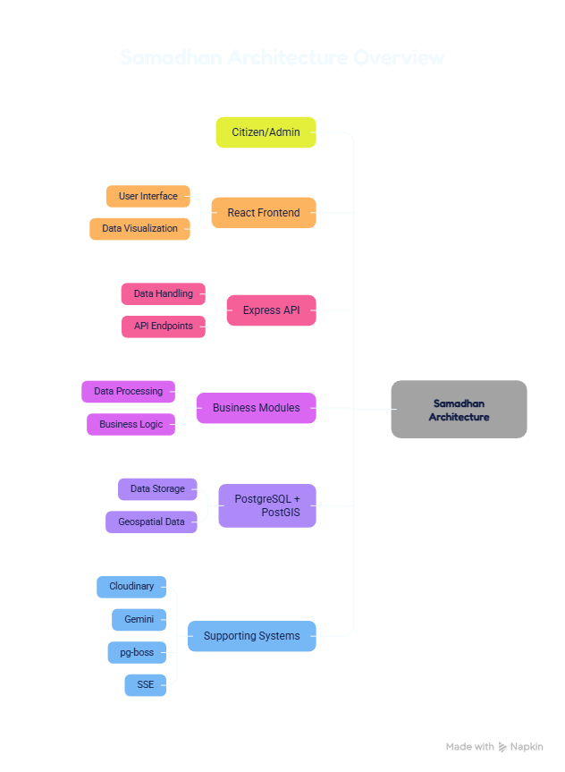

# 🏙️ Samadhan

> **Smart City Issue Reporting & Resolution Platform**

**HackInMotion 2026** · **Smart Cities & Civic Tech**

> *Because a civic issue reported today shouldn't still be a civic issue six months from now.*

---

## 📌 Overview

**Samadhan** is a full-stack civic-tech platform designed to create a transparent and structured bridge between **citizens and city administrators**.

Citizens can report civic issues such as potholes, broken streetlights, overflowing garbage bins, water leakage, damaged public property and drainage problems with **location and photo evidence**.

City administrators can then manage these reports through a structured workflow, automatically route them to the appropriate department, track their resolution, and monitor city-wide performance through analytics.

The platform is designed around the principle that a smart-city solution should not merely **collect complaints**, but should enable **intelligent routing, transparent tracking and measurable accountability**.

---

## 🎯 Problem

Cities face numerous everyday civic issues:

* 🛣️ Potholes and damaged roads
* 💡 Broken streetlights
* 🗑️ Overflowing garbage bins
* 💧 Water leakage
* 🚧 Damaged public infrastructure
* 🌊 Drainage and waterlogging problems
* 🚮 Illegal dumping

While complaint systems may exist, citizens often have limited visibility into what happens after a complaint is submitted.

Common problems include:

* Complaints receiving no visible follow-up
* Citizens not knowing which department is responsible
* Duplicate complaints for the same issue
* Lack of transparency in resolution
* Limited accountability and performance visibility

Samadhan addresses this gap by connecting **reporting → intelligent routing → resolution → verification → analytics** in one platform.

---

## 💡 Solution

Samadhan provides two purpose-built experiences:

### 👤 Citizen

Citizens can:

* Create an account and securely log in
* Report civic issues
* Pin the exact issue location on a map
* Select an issue category
* Add a description
* Upload photographic evidence
* Detect/flag potential duplicate reports
* Track the status of submitted issues
* View reported issues across the city

### 🏛️ City Administrator

Administrators can:

* Manage reported issues
* View issues across departments
* Automatically route issues to the appropriate department
* Filter and manage department queues
* Update issue status
* Add resolution notes
* Upload proof-of-resolution photographs
* Monitor issue trends
* Analyze department performance
* Identify civic issue hotspots

---

## 🔄 Issue Lifecycle

Samadhan follows a structured issue-resolution workflow:

```text
Citizen Reports Issue
        ↓
Location + Category + Description + Photo
        ↓
Duplicate Detection
        ↓
Department Routing
        ↓
Reported
        ↓
Acknowledged
        ↓
In Progress
        ↓
Resolved
        ↓
Verified / Closed
        ↓
Analytics Updated
```

Citizens can track the progress of their reported issues while administrators manage the resolution process.

---

## 🏗️ System Architecture



The architecture is designed around a full-stack, multi-role system consisting of the client application, backend services, database, mapping/geolocation services and supporting infrastructure.

### Core Components

| Component              | Responsibility                                                      |
| ---------------------- | ------------------------------------------------------------------- |
| **Frontend**           | Citizen and administrator interfaces                                |
| **Backend**            | Business logic, APIs and access control                             |
| **Database**           | Users, issues, locations, status history and department assignments |
| **Maps / Geolocation** | Issue location selection and city-wide issue visualization          |
| **Image Storage**      | Issue and resolution evidence                                       |
| **Authentication**     | Secure role-based access                                            |
| **Analytics**          | City and department performance insights                            |

---

## ✨ Key Features

### 🔐 1. Role-Based Authentication

Samadhan supports two distinct roles:

* **Citizen**
* **City Administrator**

Each role receives a different interface and permission set.

Backend-level access control ensures that administrative functionality cannot simply be accessed by manipulating the frontend.

---

### 📍 2. Map-Based Issue Reporting

Citizens can select the precise location of a civic issue using an interactive map.

Each report can contain:

* Location
* Category
* Description
* Photo evidence

This provides administrators with the geographical context required to resolve the issue efficiently.

---

### 🔎 3. Duplicate Issue Detection

Before creating a new report, Samadhan checks for potentially similar issues based on factors such as:

* Issue category
* Geographic proximity
* Recent reporting timeframe

Potential duplicates can be flagged or linked to an existing issue, helping prevent multiple reports for the same problem.

---

### 🏢 4. Automated Department Routing

Reports are automatically assigned to the appropriate department based on their category.

Example:

```text
Road Issue
    ↓
Roads Department

Garbage Issue
    ↓
Sanitation Department

Water Issue
    ↓
Water Department

Streetlight Issue
    ↓
Electricity / Public Works Department
```

The routing system is designed to remain extensible as additional categories and departments are introduced.

---

### 🔄 5. Issue Lifecycle Tracking

Every issue follows a defined resolution workflow:

**Reported → Acknowledged → In Progress → Resolved → Verified/Closed**

Administrators can update statuses, provide resolution notes and attach proof-of-resolution photographs.

Citizens can track these changes.

---

### 🗺️ 6. Interactive City Issue Map

The platform provides a city-wide map containing reported civic issues.

Issues can be visualized using markers based on relevant properties such as:

* Status
* Category
* Location

This gives citizens and administrators a geographical overview of problems across the city.

---

### 📊 7. Administrator Analytics Dashboard

Administrators can monitor city-wide performance using real database data.

Potential metrics include:

* Issues by category
* Issues by status
* Issues by department
* Average resolution time
* Department performance
* Recurring problem areas
* Civic issue hotspots

The dashboard is intended to help administrators move from simply **managing complaints** to understanding **city-level patterns**.

---

### 🗄️ 8. Persistent Data Management

The system maintains structured information for:

* Users
* Roles
* Civic issues
* Locations
* Categories
* Department assignments
* Status history
* Resolution evidence

---

### 📱 9. Responsive Interface

Samadhan is designed for both desktop and mobile environments.

The citizen experience prioritizes simple and fast issue reporting, while the administrator experience provides a more information-dense management interface.

---

### ⚠️ 10. Error Handling

The platform is designed to handle scenarios such as:

* Location permission denial
* Failed image uploads
* Map/API failures
* Invalid role access
* Invalid submissions

The goal is to provide meaningful feedback instead of leaving users with broken or blank interfaces.

---

## 🛠️ Technology Stack

> **Technology choices will be documented here as the implementation is finalized.**

### Frontend

* React.js / Next.js

### Backend

* Node.js / Express.js

### Database

* MongoDB / PostgreSQL

### Authentication

* JWT / Role-Based Access Control

### Maps & Geolocation

* [To be added]

### Image Storage

* [To be added]

### Data Visualization

* [To be added]

### Deployment

* [To be added]

---

## 📂 Project Structure

```text
Samadhan/
│
├── frontend/
│   ├── src/
│   └── ...
│
├── backend/
│   ├── routes/
│   ├── controllers/
│   ├── models/
│   └── ...
│
├── docs/
│   └── architecture-diagram.png
│
├── README.md
├── api-documentation.md
├── presentation.pptx
└── .gitignore
```

---

## ⚙️ Installation

### 1. Clone the repository

```bash
git clone [REPOSITORY-URL]
cd Samadhan
```

### 2. Install dependencies

```bash
npm install
```

If frontend and backend are separated:

```bash
cd frontend
npm install

cd ../backend
npm install
```

### 3. Configure environment variables

Create a `.env` file containing the required configuration.

```env
PORT=5000
DATABASE_URL=your_database_url
JWT_SECRET=your_secret
MAPS_API_KEY=your_api_key
```

> **Never commit `.env` or private API keys to the repository.**

### 4. Start the development server

```bash
npm run dev
```

---

## 📈 Development Progress

### Completed

* [x] Project concept and architecture
* [x] Two-role system design
* [x] Citizen issue-reporting workflow design
* [x] Administrator management workflow design
* [x] Issue lifecycle definition
* [x] Department routing concept
* [x] Duplicate detection concept
* [x] Analytics requirements
* [x] Architecture documentation

### In Progress

* [ ] Full-stack implementation
* [ ] Map integration
* [ ] Database integration
* [ ] Authentication and authorization
* [ ] Duplicate detection implementation
* [ ] Automated department routing
* [ ] Issue status workflow
* [ ] Administrator dashboard
* [ ] Analytics implementation
* [ ] Responsive UI
* [ ] Deployment

### Future Scope

* [ ] AI-based photo verification
* [ ] SLA-based automatic escalation
* [ ] Citizen upvoting and prioritization
* [ ] Public transparency score
* [ ] Multi-language reporting
* [ ] Predictive civic issue hotspots

---

## 🧠 Future Scope

Samadhan can evolve beyond issue reporting into a broader intelligent civic-management platform.

### AI-Based Verification

Computer vision could verify whether uploaded photographs actually correspond to the reported issue category or whether a resolution photograph indicates that the issue has been fixed.

### SLA-Based Escalation

Issues that remain unresolved beyond a defined threshold could automatically be escalated to higher authorities.

### Citizen Prioritization

Citizens could upvote existing issues, helping authorities identify high-impact problems.

### Public Transparency

A public-facing transparency score could show the resolution performance of departments and areas.

### Multilingual Civic Access

Citizens could report issues and receive updates in regional languages.

### Predictive Hotspot Detection

Historical civic data could be analyzed to predict locations and periods where recurring problems are likely to occur.

---

## 📊 Expected Impact

Samadhan aims to improve the relationship between citizens and civic authorities by creating visibility across the entire issue lifecycle.

### For Citizens

**Report → Track → Verify**

Citizens gain visibility into what happens after submitting a complaint.

### For Administrators

**Receive → Route → Resolve → Analyze**

Administrators receive structured information and tools to manage issues efficiently.

### For Cities

**Data → Insights → Better Decisions**

Aggregated civic data can reveal recurring problems and geographic hotspots, supporting more informed city management.

---

## 🎥 Demo Flow

The HackInMotion demonstration will showcase the complete lifecycle of a civic issue:

```text
1. Citizen logs in
        ↓
2. Citizen selects issue location
        ↓
3. Citizen uploads photo + description
        ↓
4. Samadhan checks for duplicates
        ↓
5. Issue is routed to the correct department
        ↓
6. Administrator receives the issue
        ↓
7. Administrator updates its status
        ↓
8. Resolution evidence is uploaded
        ↓
9. Citizen sees the updated status
        ↓
10. Analytics dashboard reflects the change
```

---

## 📚 Documentation

Additional project documentation:

* **Architecture:** `architecture-diagram.png`
* **API Documentation:** `api-documentation.md`
* **Presentation:** `presentation.pptx`

---

## 👥 Team

### Team Members

| Member | Role   |
| ------ | ------ |
| Divyanshu Kubde| [Role] |
| Muiz khan | [Role] |
| Harsh Shrivastava | [Role] |

---

## 🔗 Project Links

**GitHub:** [To be added]

**Live Demo:** [To be added]

**Presentation:** `presentation.pptx`

---

## 🏆 HackInMotion 2026

Built for **HackInMotion 2026**

**Theme:** Smart Cities & Civic Tech

> **Samadhan — turning civic complaints into trackable, accountable resolutions.**

---

## 📜 License

This project was developed as part of **HackInMotion 2026**.

[License to be added]

